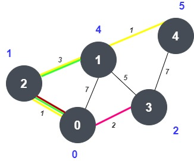
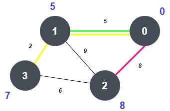

Problem statement
You have been given an undirected graph of ‘V’ vertices (labeled 0,1,..., V-1) and ‘E’ edges. Each edge connecting two nodes (‘X’,’Y’) will have a weight denoting the distance between node ‘X’ and node ‘Y’.

Your task is to find the shortest path distance from the source node, which is the node labeled as 0, to all vertices given in the graph.

Example:

Input:
4 5
0 1 5
0 2 8
1 2 9
1 3 2
2 3 6

In the given input, the number of vertices is 4, and the number of edges is 5.

In the input, following the number of vertices and edges, three numbers are given. The first number denotes node ‘X’, the second number denotes node ‘Y’ and the third number denotes the distance between node ‘X’ and ‘Y’.

As per the input, there is an edge between node 0 and node 1 and the distance between them is 5.

The vertices 0 and 2 have an edge between them and the distance between them is 8.
The vertices 1 and 2 have an edge between them and the distance between them is 9.
The vertices 1 and 3 have an edge between them and the distance between them is 2.
The vertices 2 and 3 have an edge between them and the distance between them is 6.
Note:

1. There are no self-loops(an edge connecting the vertex to itself) in the given graph.

2. There can be parallel edges i.e. two vertices can be directly connected by more than 1 edge.
   Detailed explanation ( Input/output format, Notes, Images )
   Sample input 1
   2
   5 7
   0 1 7
   0 2 1
   0 3 2
   1 2 3
   1 3 5
   1 4 1
   3 4 7
   4 5
   0 1 5
   0 2 8
   1 2 9
   1 3 2
   2 3 6
   Sample output 1
   0 4 1 2 5
   0 5 8 7
   Explanation For Sample Output 1
   Test case 1:

The source node is node 0.

The shortest distance from node 0 to node 0 is 0.

The shortest distance from node 0 to node 1 is 4. In the above figure, the green path represents this distance. The path goes from node 0->2->1, giving distance = 1+3=4.

The shortest distance from node 0 to node 2 is 1. In the above figure, the red path represents this distance. The path goes from node 0->2, giving distance = 1

The shortest distance from node 0 to node 3 is 2. In the above figure, the pink path represents this distance. The path goes from node 0->3, giving distance = 2.

The shortest distance from node 0 to node 4 is 5. In the above figure, the yellow path represents this distance. The path goes from node 0->2->1->4, giving distance = 1+3+1=5.

Test case 2:

The source node is node 0.

The shortest distance from node 0 to node 0 is 0.

The shortest distance from node 0 to node 1 is 5. In the above figure, the green path represents this distance. The path goes from node 0->1, giving distance = 5.

The shortest distance from node 0 to node 2 is 8. In the above figure, the pink path represents this distance. The path goes from node 0->2, giving distance = 8.

The shortest distance from node 0 to node 3 is 7. In the above figure, the yellow path represents this distance. The path goes from node 0->1->3, giving distance = 7.
Sample input 2:
2
9 14
0 1 4
0 7 8
1 2 8
1 7 11
2 3 7
2 5 4
2 8 2
3 4 9
3 5 14
4 5 10
5 6 2
6 7 1
6 8 6
7 8 7
5 7
0 1 7
0 2 3
1 2 1
1 3 2
1 4 6
2 3 4
3 4 4
Sample output 2:
0 4 12 19 21 11 9 8 14
0 4 3 6 10
